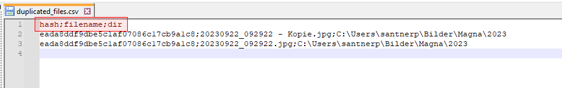

# PhotoOrganizer
Verwaltung von Photos

## Duplikate finden
***get_all_duplicated_images()*** iteriert rekursiv durch alle Verzeichnisse und schreibt die Bilder in eine Datei (***duplicated_files.csv***), 
falls diese öfter als 1x vorkommen.

Implementiert mit dem Pythonscript [ImageCompare.py](src/ImageCompare.py)

```python
  if __name__ == '__main__':
      a = ImageCompare()
      a.get_all_duplicated_images("C:\\Users\\santnerp\\Bilder")
```
Duplikate findet man dann in einer CSV-Datei:




## Images verschieben oder kopieren
